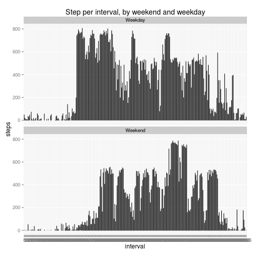

## Loading and preprocessing the data

First we load the activity data.  We convert the interval column into a factor 
to make it easier to work with, as it is not continous numeric data but instead 
a discrete feature, like the date.


```r
library(xtable)
# Load data
data <- read.csv("activity.csv")

# Convert the interval column into a factor.  
data$interval <- as.factor(data$interval)
```
### Summary of data

```r
print(xtable(summary(data)), type="html")
```

<!-- html table generated in R 3.0.2 by xtable 1.7-4 package -->
<!-- Sat Oct 11 20:52:15 2014 -->
<table border=1>
<tr> <th>  </th> <th>     steps </th> <th>         date </th> <th>    interval </th>  </tr>
  <tr> <td align="right"> 1 </td> <td> Min.   :  0.0   </td> <td> 2012-10-01:  288   </td> <td> 0      :   61   </td> </tr>
  <tr> <td align="right"> 2 </td> <td> 1st Qu.:  0.0   </td> <td> 2012-10-02:  288   </td> <td> 5      :   61   </td> </tr>
  <tr> <td align="right"> 3 </td> <td> Median :  0.0   </td> <td> 2012-10-03:  288   </td> <td> 10     :   61   </td> </tr>
  <tr> <td align="right"> 4 </td> <td> Mean   : 37.4   </td> <td> 2012-10-04:  288   </td> <td> 15     :   61   </td> </tr>
  <tr> <td align="right"> 5 </td> <td> 3rd Qu.: 12.0   </td> <td> 2012-10-05:  288   </td> <td> 20     :   61   </td> </tr>
  <tr> <td align="right"> 6 </td> <td> Max.   :806.0   </td> <td> 2012-10-06:  288   </td> <td> 25     :   61   </td> </tr>
  <tr> <td align="right"> 7 </td> <td> NA's   :2304   </td> <td> (Other)   :15840   </td> <td> (Other):17202   </td> </tr>
   </table>
## What is mean total number of steps taken per day?

To find the mean total number of steps taken per day, we subset the data by date 
and find the total steps per day.  This quantity then is used to calculate the
mean steps per day.


```r
# First, we are going to define a reuable function for this reporting.  This 
# will allow us to easily report the new values later in the research, when we 
# have imputed the missing data.
reportMeanSteps <- function() {
        dateLevels <- levels(data$date)
        
        totalStepsPerDay =data.frame(sumSteps = c(), date=c())
        # Organize per day
        for(d in dateLevels) {
                s <- sum(data[data$date == d,]$steps, na.rm=TRUE)
                totalStepsPerDay <- rbind(totalStepsPerDay, data.frame(
                        sumSteps = s, date = d))
        }
        
        hist(totalStepsPerDay$sumSteps,breaks=10,xlab="Steps per day",
                main="Histogram of Steps per Day")
        print(paste("The mean total steps per day is",
                mean(totalStepsPerDay$sumSteps),
                " and the median total steps per day is",
                median(totalStepsPerDay$sumSteps)))      
}

# Call the function to create the initial report.
reportMeanSteps()
```

 

```
## [1] "The mean total steps per day is 9354.22950819672  and the median total steps per day is 10395"
```

## What is the average daily activity pattern?


```r
intervalLevels <- levels(data$interval)

meanStepsPerInterval = data.frame(meanSteps=c(), interval=c())
for(interval in intervalLevels) {
        s <- mean(data[data$interval == interval,]$steps, na.rm=TRUE)
        meanStepsPerInterval <- rbind(meanStepsPerInterval, data.frame(meanSteps 
                = s, interval = interval))
}

plot(x=meanStepsPerInterval$interval,y=meanStepsPerInterval$meanSteps,type="l",
        main="Mean steps per interval",
        xlab="Interval",
        ylab="Steps (mean)")
# I can't seem to get plot to do lines, so cheat a bit.
lines(x=meanStepsPerInterval$interval,y=meanStepsPerInterval$meanSteps)
```

 

```r
indexMax <- which.max(meanStepsPerInterval$meanSteps)
print(paste0("The interval with the maximum mean steps is interval ",
        meanStepsPerInterval$interval[indexMax],", with a mean steps of ",
        meanStepsPerInterval$meanSteps[indexMax]))
```

```
## [1] "The interval with the maximum mean steps is interval 835, with a mean steps of 206.169811320755"
```

## Imputing missing values

```r
# Clean up NAs in the steps by imputing with the mean.

# First report a count of unavailable data.
print(paste("There are",sum(is.na(data)),"rows with NA values."))
```

```
## [1] "There are 2304 rows with NA values."
```

```r
for(interval in intervalLevels) {
        intervalMean <- mean(data[data$interval == interval,]$steps, na.rm=TRUE)
        data[(data$interval == interval) & 
                        (is.na(data$steps)),]$steps<-intervalMean
}

# Report the count after imputing. This should always be zero.
print(paste("After simple imputation, there are",sum(is.na(data)),
        "rows with NA values."))
```

```
## [1] "After simple imputation, there are 0 rows with NA values."
```


```r
print(xtable(summary(data)), type="html")
```

<!-- html table generated in R 3.0.2 by xtable 1.7-4 package -->
<!-- Sat Oct 11 20:52:21 2014 -->
<table border=1>
<tr> <th>  </th> <th>     steps </th> <th>         date </th> <th>    interval </th>  </tr>
  <tr> <td align="right"> 1 </td> <td> Min.   :  0.0   </td> <td> 2012-10-01:  288   </td> <td> 0      :   61   </td> </tr>
  <tr> <td align="right"> 2 </td> <td> 1st Qu.:  0.0   </td> <td> 2012-10-02:  288   </td> <td> 5      :   61   </td> </tr>
  <tr> <td align="right"> 3 </td> <td> Median :  0.0   </td> <td> 2012-10-03:  288   </td> <td> 10     :   61   </td> </tr>
  <tr> <td align="right"> 4 </td> <td> Mean   : 37.4   </td> <td> 2012-10-04:  288   </td> <td> 15     :   61   </td> </tr>
  <tr> <td align="right"> 5 </td> <td> 3rd Qu.: 27.0   </td> <td> 2012-10-05:  288   </td> <td> 20     :   61   </td> </tr>
  <tr> <td align="right"> 6 </td> <td> Max.   :806.0   </td> <td> 2012-10-06:  288   </td> <td> 25     :   61   </td> </tr>
  <tr> <td align="right"> 7 </td> <td>  </td> <td> (Other)   :15840   </td> <td> (Other):17202   </td> </tr>
   </table>

### Summary of data after imputing

```r
# Report on the data after imputing.
reportMeanSteps()
```

 

```
## [1] "The mean total steps per day is 10766.1886792453  and the median total steps per day is 10766.1886792453"
```

After imputing the missing data by interval, the data has become closer to (but
not exactly) a normal distribution, with the median and the mean being equal. 

## Are there differences in activity patterns between weekdays and weekends?

The following graph highlights the differences between weekend and weekday 
activity.  Weekend appear to have a narrow interval band, and less overall 
activity.


```r
dayType <- rep("Weekday",times = length(data$date))

isWeekend <- weekdays(as.Date(data$date)) %in% c("Saturday", "Sunday")

dayType[isWeekend] <- "Weekend"
data2 <- data.frame(data, dayType)

# plot() is easier for simple plot but ggplot makes the fancier panel plot easier.
library(ggplot2)
```

```
## Find out what's changed in ggplot2 with
## news(Version == "1.0.0", package = "ggplot2")
```

```r
ggplot(data2,aes(interval,steps))+geom_line() + facet_wrap(~dayType, nrow=2) +
        labs(title="Step per interval, by weekend and weekday")
```

 
